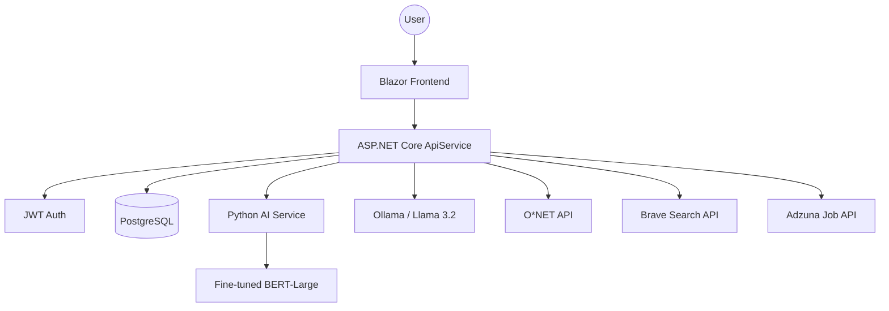

# 🌊 CareerSEA: AI-Powered Career Path Consultant

**Empowering Graduates and Professionals with Data-Driven Career Guidance**

**CareerSEA** is a state-of-the-art, cloud-native web application designed to navigate the complexities of the modern job market. By leveraging fine-tuned Transformer models (BERT) and Large Language Models (Llama 3.2), CareerSEA transforms raw professional experience into actionable career trajectories, identifying skill gaps and providing real-world learning resources and job opportunities.

---

## 🚀 Key Features

CareerSEA offers a comprehensive end-to-end career development lifecycle:

*   **📄 AI-Powered CV Extraction**: Upload your PDF resume and let **Llama 3.2** (orchestrated via Ollama) automatically extract your job history, descriptions, and technical skills with high precision.
*   **🔮 Semantic Career Prediction**: Utilizing a **fine-tuned BERT-large** model, the system analyzes your career "embeddings" to predict the best-matching role from the global **ESCO** (European Skills, Competences, Qualifications and Occupations) framework.
*   **⚖️ Skill Gap Analysis**: Seamlessly integrated with the **O*NET API**, CareerSEA identifies the specific technologies and tools required for your target role that are missing from your current profile.
*   **📚 Personalized Learning Paths**: Automatically discovers high-quality courses and tutorials from **YouTube, Udemy, Coursera, and freeCodeCamp** via the **Brave Search API**, tailored specifically to your identified skill gaps.
*   **💼 Real-Time Job Market**: View live job openings directly for your predicted career path through the **Adzuna API** integration.
*   **☁️ Cloud-Native Resilience**: Built on **.NET Aspire** with a distributed architecture, featuring automated retries and circuit breakers via **Polly** for high availability.

---

## 🛠️ Tech Stack

CareerSEA is a polyglot distributed system designed for performance and scalability:

| Layer | Technology | Description |
| :--- | :--- | :--- |
| **Frontend** | **Blazor (Fluent UI/MudBlazor)** | Interactive, high-performance web interface. |
| **Backend** | **ASP.NET Core 9.0** | Robust RESTful API with JWT security and Swagger. |
| **AI Orchestration** | **.NET Aspire & Ollama** | Microservice orchestration and LLM management. |
| **Core AI Model** | **Python (FastAPI)** | Fine-tuned `bert-large-uncased` for semantic job matching. |
| **LLM Engine** | **Llama 3.2 (3B)** | Local LLM for structured data extraction from resumes. |
| **Database** | **PostgreSQL & pgvector** | Relational storage with vector search capabilities. |
| **External APIs** | **O*NET, Brave, Adzuna** | Industry-standard data for skills, resources, and jobs. |

---

## 📐 Architecture Overview



---

## 🏁 Quick Start

### Prerequisites
*   [.NET 9.0 SDK](https://dotnet.microsoft.com/download/dotnet/9.0)
*   [Docker Desktop](https://www.docker.com/products/docker-desktop/)
*   [Ollama](https://ollama.com/) (Required for CV parsing)

### Setup & Run

1.  **Clone the Repository**:
    ```bash
    git clone https://github.com/sarperim/CareerSEA.git
    cd CareerSEA
    ```

2.  **Model Preparation**:
    Ensure the BERT model and tokenizer files are present in `CareerSEA.Py/fine_tuned_BERT` and `CareerSEA.Py/tokenizer`.

3.  **Launch with .NET Aspire**:
    Simply run the AppHost project. Aspire will automatically spin up the database, Python service, and web application.
    ```bash
    dotnet run --project CareerSEA.AppHost
    ```

4.  **Ollama Note**: 
    The system uses `llama3.2:3b`. On first run, Ollama will pull the model. If using a mid-range GPU (like an RTX 3050), allow up to 5 minutes for the initial "cold start" load.

---

## 📖 References & Data Sources
*   **ESCO Dataset**: European classification of Skills, Competences, Qualifications and Occupations.
*   **KARRIEREWEGE**: Large-scale career path prediction dataset.
*   **CareerBERT**: Inspired by the research of Rosenberger et al. (2025) on shared embedding spaces for job recommendations.
*   **O*NET OnLine**: Data provided by the U.S. Department of Labor.

---

**Developed by Sarp Ercan, Emir, and Alphan as a Graduation Project.**
