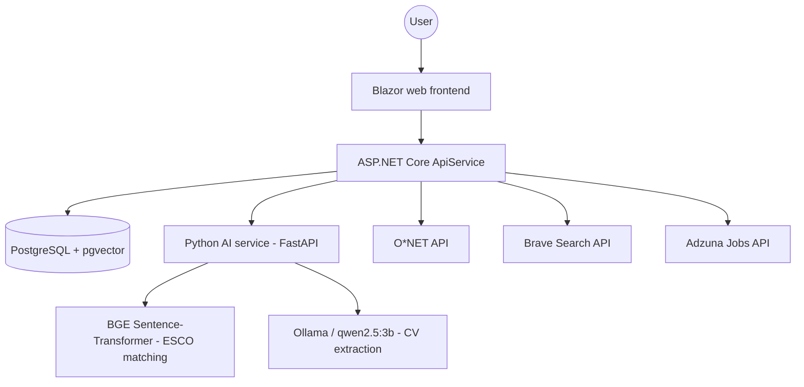

# CareerSEA

CareerSEA is an AI-powered career-path consultant. You give it your work
experience (by uploading a PDF CV or typing it in), and it predicts your
best-matching occupation from the **ESCO** framework, shows the skills you are
missing for that role, finds live job openings, and recommends courses to close
the gap.

It is a cloud-native, polyglot distributed system orchestrated by **.NET
Aspire**:

- **Blazor** web frontend (`CareerSEA.Web`)
- **ASP.NET Core 9.0** REST API with JWT auth (`CareerSEA.ApiService`)
- **Python / FastAPI** AI service (`CareerSEA.Py`) — a **BGE sentence-transformer**
  for semantic ESCO matching plus **Ollama / `qwen2.5:3b`** for CV extraction
- **PostgreSQL + pgvector** for storage
- External data via **O\*NET** (skills), **Adzuna** (jobs) and **Brave** (courses)

This document contains three manuals:

1. **User Manual** — how an end-user uses the running product.
2. **Installation Manual** — how an end-user installs and runs it locally.
3. **Deployment Details** — how a developer deploys it from source.

---

## 1. User Manual

### 1.1 What CareerSEA does for you

| Step | Feature | What you get |
| :--- | :--- | :--- |
| Input | CV upload or manual entry | Your work experiences captured as Title + Description + Skills |
| Predict | Semantic role matching (BGE/ESCO) | Best-matching ESCO occupation + a match score + top alternatives |
| Analyze | Skill-gap analysis (O\*NET) | Which technologies you already have vs. which you are missing |
| Jobs | Live openings (Adzuna) | Real, clickable job listings for your predicted role |
| Learn | Course recommendations (Brave search) | Tutorials/courses from YouTube, Udemy, Coursera, freeCodeCamp |
| Save | Bookmarks | Saved jobs and saved courses kept on your account |

### 1.2 Create an account / sign in

CareerSEA is account-based. Your experiences and saved items are tied to your
login.

1. Open the web app in your browser. The exact URL is shown in the Aspire
   dashboard — see the Installation Manual.
2. Go to **Sign Up** (`/signup`) and register with your email and a password.
3. **Log in**. On success you receive a JWT session token and land in the app.

> Authentication is JWT-based. Logging in stores your token for the session; you
> stay signed in until the token expires or you log out.

### 1.3 Add your experience

Go to the **Experience Dashboard** (route `/experience`). Two ways to enter your
career history — you can mix both.

**Option A — Upload a PDF CV (fastest)**

1. Click **Upload PDF CV** and choose a `.pdf` file.
2. The AI service (`/extract-cv`, powered by `qwen2.5:3b`) reads the PDF and
   extracts each distinct role, filling the *Add Experiences* form with Title,
   Description, and Skills for every job it found.
3. **Review** the extracted experiences before predicting — correct anything
   that looks wrong.

> The first upload can be slow (up to a few minutes) because the local language
> model has to warm up ("cold start"). Later uploads are fast. Only text-based
> PDFs work — scanned/image-only PDFs cannot be read (you will see a "PDF
> parsing failed / no extractable text" message).

**Option B — Enter experiences manually**

For each role:
1. **Job Title** — pick from the searchable ESCO job-title list (start typing to
   filter).
2. **Job Description** — paste or write what you did in that role.
3. **Skills** — list your tools/technologies, comma-separated.

Use **Add New Experience** to add more roles, or the delete icon to remove one.
All three fields are required for each experience.

### 1.4 Get your prediction

Click **CREATE PREDICTION**. CareerSEA encodes your experiences with the BGE
model and matches them against the ESCO occupation list, then takes you to the
**Results** page (`/result`).

### 1.5 Read your results

The Results page shows:

- **Best Match** — your top predicted occupation, with a **match score**
  (0–100%). Color reflects strength (green = strong, red = weak).
- **Top Alternatives** — other close occupations, each with its own match bar.
- **View Openings / search icons** — click to pull **live job listings**
  (Adzuna) for that title. Each listing links out to the posting.
- **Skill Gap Analysis** — click **Analyze My Skills**. CareerSEA looks up the
  role in O\*NET and splits required technologies into **Matched Skills** (you
  already have them) and **Missing Skills** (to learn). If O\*NET has no exact
  title, it uses the closest role and tells you so.
- **Recommended Courses** — click **Find Courses**. CareerSEA searches the web
  (Brave) for high-quality tutorials/courses for your missing skills, grouped
  per skill, with the provider shown.

### 1.6 Save items for later

- Click the **bookmark icon** next to any job listing or course to save it to
  your account. Click again to remove it.
- Open the **Saved** page (`/saved`) to review everything you bookmarked.

### 1.7 Tips & limitations

- More detailed descriptions and explicit skill names produce better matches.
- Job openings come from Adzuna and default to the United Kingdom region.
- The home/counter links in the side nav are leftover template pages; the real
  workflow is **Experience → Results → Saved**.

---

## 2. Installation Manual

For an end-user who wants to **run CareerSEA on their own machine**. The whole
system (database, AI service, API, web app, local LLM) is orchestrated by .NET
Aspire — you start one project and Aspire launches the rest.

### 2.1 Prerequisites

| Requirement | Why |
| :--- | :--- |
| [.NET 9.0 SDK](https://dotnet.microsoft.com/download/dotnet/9.0) | Builds and runs the Aspire app, API, and web frontend |
| [Docker Desktop](https://www.docker.com/products/docker-desktop/) (running) | Aspire starts PostgreSQL, the Python AI service, and Ollama as containers |
| Disk space (~10 GB+) | Container images + the Ollama model (`qwen2.5:3b`) + the BGE embedding model |

> Notes:
> - Aspire provisions **Ollama** and **PostgreSQL** as containers for you — you
>   do not need to install them separately. On first run Ollama downloads the
>   `qwen2.5:3b` model, which can take several minutes.
> - The AI service runs **CPU-only** by default (`CUDA_VISIBLE_DEVICES=-1`), so a
>   GPU is not required (just slower on first use).

### 2.2 Get the source and the model files

```bash
git clone https://github.com/sarperim/CareerSEA.git
cd CareerSEA
```

The semantic-matching model must be present at `CareerSEA.Py/model` (the
`model.safetensors`/weights, `config.json`, and tokenizer files for the
sentence-transformer). If your clone shipped only a placeholder there, obtain
the model files from your team's model storage and place them in that folder
before running — `/predict` fails without them.

### 2.3 Configure required keys

The app calls external services. For a quick local run, defaults for the JWT
secret (in `CareerSEA.ApiService/appsettings.Development.json`) and the external
APIs (Adzuna, O\*NET, Brave) are already wired up. To use your own keys, set
them via user-secrets or environment variables:

```bash
# from the repo root, in CareerSEA.ApiService
dotnet user-secrets set "Jwt:SecretKey"  "<your-long-random-secret>"
dotnet user-secrets set "Onet:ApiKey"    "<your-onet-key>"
dotnet user-secrets set "Brave:ApiKey"   "<your-brave-key>"
dotnet user-secrets set "Adzuna:AppId"   "<your-adzuna-app-id>"
dotnet user-secrets set "Adzuna:AppKey"  "<your-adzuna-app-key>"
```

> **Security note:** the repository currently has live API keys committed in
> `CareerSEA.ApiService/appsettings.json`. Before any public or shared use,
> rotate those keys and move them to user-secrets / environment variables.

### 2.4 Run

Make sure Docker Desktop is running, then start the Aspire AppHost:

```bash
dotnet run --project CareerSEA.AppHost
```

Aspire will:
- start **PostgreSQL** (pgvector `pg17`) with databases `webAppDb` and
  `vectorDb`, and apply migrations on API startup,
- start **Ollama** and pull `qwen2.5:3b`,
- build and start the **Python AI service** (port 8001),
- start the **API service** and the **web frontend**.

### 2.5 Open the app

The console prints an **Aspire dashboard** URL. Open it to see every service and
its health, and to find the **web frontend** endpoint. Click that endpoint to
open CareerSEA, then follow the **User Manual** (sign up → add experience →
predict).

### 2.6 Troubleshooting

| Symptom | Cause / fix |
| :--- | :--- |
| First CV upload / prediction times out | LLM cold start — wait and retry; allow up to ~5 min on the first call |
| Service stuck "waiting" in the dashboard | Docker not running, or model still downloading — check Docker, give it time |
| Prediction returns nothing / 500 | Model files missing from `CareerSEA.Py/model` — see §2.2 |
| "PDF parsing failed" | The PDF is scanned/image-only; use a text-based PDF |
| Empty job listings | No live openings for that exact title in the region — try an alternative role |

---

## 3. Deployment Details

For a **developer** deploying CareerSEA from source. The project ships an
`azure.yaml` and targets **Azure Container Apps** via the **Azure Developer CLI
(`azd`)**, but it also runs locally for development.

### 3.1 Architecture (what gets deployed)


```mermaid
graph TD
    User((User)) --> Web[Blazor web frontend]
    Web --> API[ASP.NET Core ApiService]
    API --> DB[(PostgreSQL + pgvector)]
    API --> Py[Python AI service - FastAPI]
    Py --> Embed[BGE Sentence-Transformer - ESCO matching]
    Py --> Ollama[Ollama / qwen2.5:3b - CV extraction]
    API --> ONET[O*NET API]
    API --> Brave[Brave Search API]
    API --> Adzuna[Adzuna Jobs API]
```

Orchestration is defined in code in `CareerSEA.AppHost/AppHost.cs`. The
deployable resources are:

| Resource | Project / image | Notes |
| :--- | :--- | :--- |
| `postgres` | `pgvector/pgvector:pg17` | Databases `webAppDb` and `vectorDb`; migrations run on API startup |
| `ollama` | Aspire Ollama integration | Hosts model `qwen2.5:3b`; data volume; flash attention on |
| `aiservice` | `CareerSEA.Py/dockerfile` (FastAPI, port 8001) | CPU-forced (`CUDA_VISIBLE_DEVICES=-1`); model bind-mounted at `/app/model`; ESCO titles mounted from `JobTitles.cs` at `/app/data` |
| `apiservice` | `CareerSEA.ApiService` | REST API, JWT auth, Swagger (dev), `/health` healthcheck; references DB + aiservice |
| `webfrontend` | `CareerSEA.Web` | Blazor UI, public endpoint, `/health` healthcheck, references the API |

API controllers: `Auth`, `ExperiencePrediction`, `JobPost`,
`ResourceRecommendation`, `SavedItems`, `SkillGap`. AI-service endpoints:
`/health`, `/embed`, `/predict`, `/batch-predict`, `/extract-cv`.

### 3.2 Local / developer run

```bash
git clone https://github.com/sarperim/CareerSEA.git
cd CareerSEA
dotnet run --project CareerSEA.AppHost
```

This is the inner-loop workflow — Aspire stands up all resources and exposes the
dashboard. Edit code, restart the AppHost to re-run. Swagger UI is available on
the API service in Development for exercising endpoints directly.

### 3.3 Deploy to Azure with `azd`

`azure.yaml` registers the AppHost as the single `azd` service and targets
`containerapp` hosting:

```yaml
name: career-sea
services:
  app:
    language: dotnet
    project: ./CareerSEA.AppHost/CareerSEA.AppHost.csproj
    host: containerapp
```

Steps:

```bash
# one-time auth
az login
azd auth login

# initialize the azd environment (pick a name, subscription, region)
azd init      # only if no azd environment exists yet

# provision Azure infra AND deploy app code in one step
azd up
```

`azd` reads the AppHost manifest, generates the infrastructure-as-code
(Container Apps environment, each service as a container app, PostgreSQL, the
AI-service container, etc.) and deploys. When it finishes it prints the public
service endpoints — open the `webfrontend` URL to verify.

To split the steps: `azd provision` (infra) then `azd deploy` (code). To inspect
or customize the generated Bicep, run `azd infra gen` (writes an `infra/` folder;
after that those files become the source of truth).

### 3.4 Production configuration

Provide these as Container Apps secrets / app settings (not in `appsettings.json`):

| Key | Purpose |
| :--- | :--- |
| `Jwt:SecretKey` | Signs/validates auth tokens — must be a long random secret in prod |
| `Onet:ApiKey` | O\*NET skill-gap lookups |
| `Brave:ApiKey` | Course/resource search |
| `Adzuna:AppId`, `Adzuna:AppKey` | Live job listings |

Connection strings for PostgreSQL and the AI-service URL are injected by Aspire
service discovery, so you do not hand-wire them.

> **Rotate the committed keys.** Live Adzuna/O\*NET/Brave keys are currently in
> `CareerSEA.ApiService/appsettings.json` in the repo. Remove them from source,
> rotate them at each provider, and supply replacements through secrets before
> deploying anywhere shared.

### 3.5 CI/CD

Wire up an automated pipeline with:

```bash
azd pipeline config -e <environment-name>
```

Choose **GitHub** (GitHub Actions) or **Azure DevOps** when prompted; if the
`azure-dev.yml` pipeline file is missing, accept the prompt to add it. This
configures the pipeline to authenticate to Azure and run `azd` on push.

### 3.6 GPU note (optional)

The AI service is pinned to CPU for portability (`CUDA_VISIBLE_DEVICES=-1` in
`AppHost.cs`). To use a GPU in an environment that has one, remove/adjust that
environment variable and set `DEVICE=cuda` (and optionally `USE_FP16=true`) for
the `aiservice`; the Python service auto-detects CUDA/MPS otherwise.
</content>

